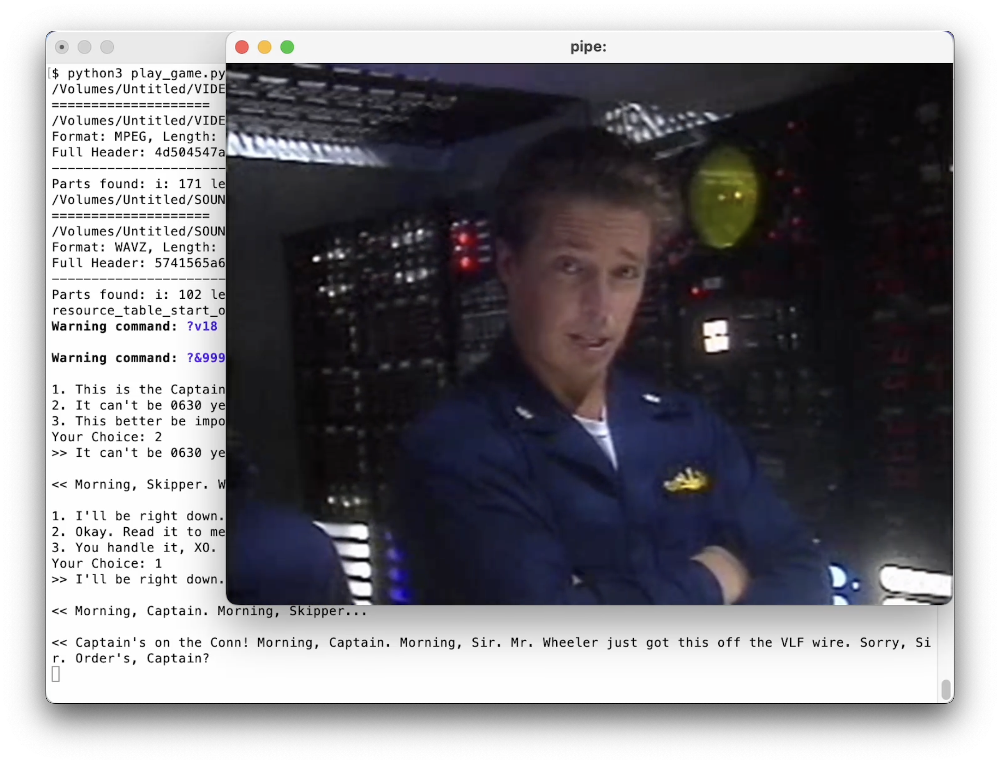

# Reverse Engineering Silent Steel

Silent Steel is a 1995 submarine simulator computer game by Tsunami Games. It was created during the influx of interactive movies during the 1990s. The game is composed almost entirely of live-action full motion video, with sparse computer-generated graphics depicting external shots of the boat during torpedo attacks and atmospheric fly-bys. More information about _Silent Steel_ is available on [Wikipedia](https://en.wikipedia.org/wiki/Silent_Steel), [MobyGames](https://www.mobygames.com/game/7993/silent-steel/) and the [ScummVM Wiki](https://wiki.scummvm.org/index.php/Silent_Steel).

This project tries achieve two main goals:

- Reverse engineer the game files.
- Implement a bare-bones interpreter in Python to play the game on modern machines.

The game was originally released as a 16-bit executable for Windows 3.1. Additionally, this project provides documentation for a full re-implementation of the game (e.g. as a ScummVM engine).

## Status

Much of the game is playable, but some parts of the game scripts are still not 100% understood or implemented.

**[Watch the first 10min 🎬 on Youtube](https://youtu.be/tYT6yM3C5GM)**

For a full documentation of the data formats and other details, check out the writeup on @chkuendig's personal website: **[March 14, 2023: Reverse Engineering the 1995 FMV Game Silent Steel](https://christian.kuendig.info/posts/2023-03-silentsteel/)**, or in the **[Reverse Engineering document](./ReverseEngineering.md)**.

## Compatibility

At the moment, this project supports the following versions of the game:

- Promotional version (MPEG only), available at the [Internet Archive](https://archive.org/details/silentsteeldisconepromotional). This version is based on the Windows 3.1 MPEG release.
- Full retail versions (MPEG and AVI releases) available on eBay.

There were many releases of this game, it's not clear whether the later PC releases (namely the DVD-ROM release), were implemented in the same way. There exists a rare DVD Video version, that utilizes standard DVD Player functions for control. However, it is too technically different to be utilized in this current implementation.

## Installation/Usage Requirements

- **Python 3**:
  - Additional Python requirements should be installed using `pip install -r requirements.txt`
- **FFmpeg** (specifically `ffplay`)
  - If an instance of ffmpeg is found on the machine, it will be used. Otherwise, `local-ffmpeg` from `requirements.txt` will be used.

## How to Use

To run the game:

- Mount game media, either Disc 1 (MPEG or AVI Full Retail Version) or the MPEG Promotional Disc version.
- Run `play_game.py`, passing the mount folder as an argument:
  - Example: `python3 play_game.py /Volumes/Untitled`

The arguments for `play_game.py` are:

- `--promo, -p`: indicates that the MPEG Promotional version of the game is running. (Note: this may be swapped out for automatic detection based on `?v` instruction value.)
- `--salty, -x`: runs the "salty language" version of the game (e.g. uncensored).
- `--auto, -a`: runs the game in a "demo mode". This skips requests for user input.
- `--scene, -s`: starts the game at a specified scene. If not provided, the first scene is used.
- `--silent_run`: runs the game where the player character's audio is muted.
- `--debug, -d`: enables verbose output for debugging purposes.
- `--input_queue, -i`: passes in a list of inputs, instead of the player having to select the options directly.
- `media_path`: the mount path for the media of the game.
