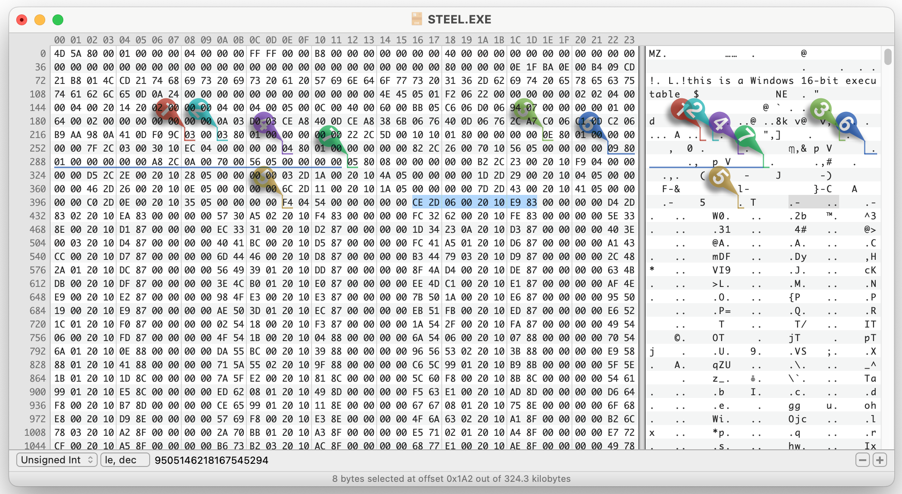

# Reverse Engineering and Technical Details

The following is a technical overview and reverse engineering details of Silent Steel.

## Game Data Formats

### Game Executable Resources

`STEEL.EXE` is the main game executable in 16 bit [New Executable](https://en.wikipedia.org/wiki/New_Executable) format and contains all scripts as resources. This format is very well documented and there's multiple portable parsers for it. I used the [radare2 source code](https://github.com/radareorg/radare2/blob/master/libr/bin/format/ne) and [OSDEV.org Wiki](https://wiki.osdev.org/NE) for my research.

**How to parse `STEEL.EXE`:**

Thankfully, the format is not too complicated. So, it's pretty straightforward to get to the scripts and the identifiers we need:

- The first `0x80` (128) bytes are the DOS Stub, we can ignore this, but have to remember to add this count to some offsets later.
- The position of the resources table is encoded at byte 35 in the header (see OSDEV link above) - byte 163 in the file.
- In our case, this byte is '00x60' or 96 in decimal. Adding this to the start of the header at 128 bytes means we now jump to byte 224.
- I'll skim over the details of the resource table, but the resources we are looking for (type `F4 04` in Ghidra, though that's actually the address of the string id - which is "DATA") start at byte 410 and theres 85 (`\x54` in the 3rd byte) of them. The first two resources look as follows: (2nd line parsed)
  

  ```
  Field:  | Offset     | Size    | Attributes   | Resource Type ID
  Raw:    | CE 2D      | 06 00   | 20 10        | E9 83
  Parsed: |   01 6E 70 |  00 30  | 1020 (,Pure) |  83E9 -> 03E9 -> ID: 1001
  Raw:    | D4 2D      | 83 02   | 20 10        | EA 83
  Parsed: |   01 6E A0 |   14 18 | 1020 (,Pure) |  83EA -> 03EA -> ID: 1002
  ```

  - **Size and Offset** need to be left shifted according to the exponent encoded at the start of the resource table. (byte 224 which is x03 in our case). FYI: the offset is relative to the start of the file, not the Windows header like most of the other offsets. Example:
    - _Size 1:_ `06 00` (Little Endian/LE) 0000 0110 0000 0000, Big Endian/BE: 0000 0000 0000 0110, lshift by 3 -> 0011 0000 -> size is `00 30`
    - _Offset 1:_ `CE 2D` (LE) 1100 1110 0010 1101, BE: 0010 1101 1100 1110, shift by 3: 1 0110 1110 0111 0000 -> offset is `01 6E 70`
    - _Size 2:_ `83 02` (LE), BE: x02x83, 0000 0010 1000 0011, by 3: 0001 0100 0001 1000 \_> size is `14 18`
    - _Offset 2:_ `D4 2D` (LE),BE: x2DxD4, 0010 1101 1101 0100, by 3: 1 0110 1110 1010 0000 -> offset is `01 6E A0`
  - **Resource Type ID**: This is an integer type if the high-order bit is set (8000h); otherwise, it is an offset to the type string. In our case these are always integers for the resource types we care about.

In the end (and way too late), I discoverd the amazing [nefile](https://github.com/npjg/nefile) project, which does this all for us, and which is what I ended up using for the player.

### Game Scripts

Once extracted, the game scripts follow a simple syntax. To explain, lets go through the start of the MPEG promo disc:

**Resource 1001:**

```text
{
    sequence > ?v18 > ?r$1001; > ?j1002
}
```

This means that in sequence, three things will happen:

- `?v18`: Unknown meaning, possibly an entry point for the game code. However, this correlates with the game player version.
- `?r$1001;`: Play Video 1001.
  - Please note: if there's text after `;`, it will be printed out as subtitles.
- `?j1002`: Jump to Resource 1002.

**Resource 1002:**

```text
{
    sequence > ?&9999 > ?r$1002;
}
```

- `?&9999`: Unknown meaning (video maybe a marker for savegames/checkpoint?)
- `?r$1002;`: Play video 1002

```text
 1 EXCHANGE {
    + !0001This is the Captain. {
       > ?r$1003;Captain, sorry to wake you. We just received an urgent message from COMSUBLANT.
   }
   [...]
    = !0002It can't be 0630 yet. XO, what's up? {
       > ?r$1004;Morning, Skipper. We just received an urgent message from COMSUBLANT.
   }
   [...]
    - !0003This better be important. {
       > ?r$1005;Good morning, Sir. We just received urgent traffic from COMSUBLANT.
   }
   [...]
}
```

This is the first time the player gets to make a decision:

- `1 EXCHANGE` marks the start of an exchange (player controlled dialogue).
  - Exchanges are played sequentially, but can be skipped with a jump instruction (see below).
  - The player always has three dialogue lines to choose from, encoded as strings starting with `+`,`=` or `-` follow by an exclamation mark and a four digit number indicating the index of the segment for the voice track followed by the dialogue line as text.
  - After each dialogue line, three possible consequences are lined up. Encoding is the same as the sequence discussed initially. In this case it's a video (`r$1003`,`r$1004` or `r$1003`) with subtitles, but it can also be multiple segments (separated by `>`) and include jumps (in which case the exchange is over).
  - Often all three consequences are the same (which is why i removed them from the snippet above), but sometimes there's different ones which presumably get picked randomly.

```text
 2 EXCHANGE {
    + !0004I'll be right down. {
       > ?r$1012;Morning, Captain. Morning, Skipper... > ?j2001
   }
   [...]
}
```

- This consequence has a jump (`?j2001) meaning that this choice ends the exchange and the game continues at resource 2001.

#### ?v Instruction (Versioning?)

The `?v` instruction only appears once right at the beginning of the game. It is followed by a numeric value, which correlates with the game player version. For some reason, it's specifically the third segment of a four segment version (e.g. for the MPEG Promo version, the player version is 1.24.18.121, where the `?v` instruction is `?v18`. For the full retail AVI version, the version is 1.71.41.135, where the `?v` instruction is `v41`.

#### ?g Instruction (Disc Swapping)

The full retail version of the game, namely the MPEG and AVI versions of the game, are split across four discs total. Throughout the game, the player may be directed to swap to another disc. That request is handled through a `?g` instruction.

The `?g` instruction typically has two numeric values following it. The first value represents the target disc, while the second is the target resource on the target disc.

In the Promotional MPEG version of the game, `?g` appears 50 times. Although, this version of the game does not have additional discs to swap. Therefore, a lot of the exchanges that result in a disc swap instead redirect to the "game over" sequence, where you are facing an Naval officer behind a desk.

#### ?s0100 Instruction (End of Game)

`?s0100` appears 15 times in the MPEG Promo version. This instruction indicates an end of game condition. When this instruction is reached in execution, a dialog appears, asking the player for further action (e.g. Restart, Load a Save, Quit, etc.)

#### Other Instructions

Throughout the script, a few more unknown instructions are used. The purpose of these instructions is unclear.

`?&` appears 61 times in the MPEG Promo version. Nothing actually seems to happen in the original game at these points. Maybe it's a save game state?

`?*` appears 45 times in the MPEG Promo version. Could also be an alternative video play or jump instruction? It has multiple comma-separate numbers following it (instead of a single number for the previously discussed instructions). Possibly a sequence of videos or a random jump?

### Media Files

The MPEG Promo version has the following media files on disc:

- `VIDEO1.MPG` contains all the video shown in the game. It's a concatenation of many [MPEG-PS](https://en.wikipedia.org/wiki/MPEG_program_stream) streams, each with their own MPEG-PS header (easily identifiable in the file by their sync bytes `00 00 01 BA`). For our purposes we don't care about the header content as we directly pass the streams cut to the offset of the selected index we found in the index file to `ffplay`.
- `SOUNDS1.WAV` contains all audio lines from the protagonist (usually played based on the choice by the player). It's a simple https://en.wikipedia.org/wiki/WAV File with a single PCM encoded audio stream. As the offsets in the index file are are byte based, we convert the offsets into a timestamp (easily done based on bitrate as there is no compression) before passing the full file to `ffplay`.
- `VIDEO1.IDX` and `SOUNDS1.IDX` are indexes for the above two files. They contain a list of indexes used in the game scripts and file offsets for each media segment. From what I can tell, the media segments are not overlapping (although there's a lot of duplicated content) and the offsets mark both start of an segment as well as the end of the previous segment.

The MPEG Full Retail version also contains more media on the other discs. These files behave like their Disc 1 (Promo Disc) counterparts:

- `VIDEO2.MPG`, `VIDEO3.MPG`, and `VIDEO4.MPG`.
- `SOUNDS2.WAV`, `SOUNDS3.WAV`, and `SOUNDS4.WAV`
- `VIDEO2.IDX`, `SOUNDS2.IDX`, `VIDEO3.IDX`, `SOUNDS3.IDX`, `VIDEO4.IDX`, `SOUNDS4.IDX`.

Please note: some of the audio and video segments are duplicated across these all of these files, to reduce the need for disc swapping.

The AVI Full Retail version is exactly like this MPEG Full Retail version, except the video files are now in the [AVI](https://en.wikipedia.org/wiki/Audio_Video_Interleave) format, using the `.AVI` extension.

#### `.IDX` File Format

Both audio and video index files are formatted the same way, they start with a 16 byte header and then 6 byte fields for each segment index and offset.

- Header Format: (16 bytes)

  | **Start** | **Length** | **Description** |
  |------- |--------- |-------------------------------------------- |
  | 0 | 4 bytes | Media Format in ASCII. Either `WAVZ`, `MPEG`, or `AVIS`. |
  | 4 | 8 | _unknown_ |
  | 12 | 2 | last index as little endian integer |
  | 14 | 2 | _unknown_ |

- Segment Format: (6 bytes)

  | **Start** | **Length** | **Description** |
  |------- |--------- |-------------------------------------------- |
  | 0 | 2 bytes | Index as little endian integer |
  | 2 | 4 | File offset for index as little endian integer |

## Additional Tools Used

- [Ghidra](https://ghidra-sre.org/) and [Visual Studio Code](https://code.visualstudio.com/), to browse the resources and poke around a bit - didn't decompile anything really.
- [UTM](https://github.com/utmapp/UTM) and [VMWare Player](https://knowledge.broadcom.com/external/article/309355/downloading-and-installing-vmware-player.html#mcetoc_1i88i98vn7), to emulate a PC from the era and run Windows 98 (couldn't get Windows 95 running)
