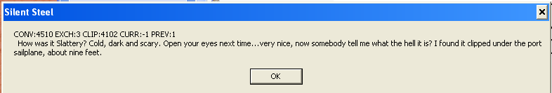
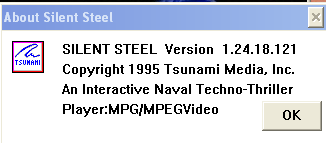
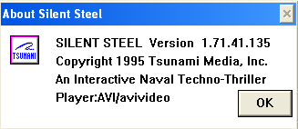

# Silent Steel Technical and Reverse Engineering Information

The following is a technical overview and reverse engineering details of Silent Steel. Let's start with the core elements of this game.

## Multimedia Files

Silent Steel is one of the earliest PC games to utilize multimedia on this scale. Tsunami really pioneered the interactive movie genre. As such, the multimedia files used are also cutting-edge for the time.

### Promotional Version

Looking at the MPEG Promo version, the following media files on a single disc:

- `VIDEO1.MPG`
- `SOUNDS1.WAV`
- `VIDEO1.IDX`
- `SOUNDS1.IDX`

`VIDEO1.MPG` contains all the video shown in the game. It's a concatenation of many [MPEG-PS](https://en.wikipedia.org/wiki/MPEG_program_stream) streams, each with their own MPEG-PS header (easily identifiable in the file by their sync bytes `00 00 01 BA`). For our purposes, we don't care about the header content as we directly pass the streams cut to the offset of the selected index we find in the index file to `ffplay`.

`SOUNDS1.WAV` contains all audio lines from the protagonist (usually played based on the choice by the player). It's a simple [WAV](https://en.wikipedia.org/wiki/WAV) file with a single PCM encoded audio stream. As the offsets in the index file are are byte-based, we convert the offsets into a timestamp (easily done based on bitrate as there is no compression) before passing the full file to `ffplay`.

`VIDEO1.IDX` and `SOUNDS1.IDX` are index files for the multimedia files. They contain a list of indices used in the game scripts, which map to file offsets for each media segment. From what @chkuendig can tell, the media segments are not overlapping (although there's a lot of duplicated content) and the offsets mark both start of a segment as well as the end of the previous segment.

### Full Retail Version

The MPEG Full Retail version expands to four discs total. Each disc contains even more media. These files behave like their Promo Disc counterparts:

- Disc 1
  - `VIDEO1.MPG`
  - `SOUNDS1.WAV`
  - `VIDEO1.IDX`
  - `SOUNDS1.IDX`
- Disc 2
  - `VIDEO2.MPG`
  - `SOUNDS2.WAV`
  - `VIDEO2.IDX`
  - `SOUNDS2.IDX`
- Disc 3
  - `VIDEO3.MPG`
  - `SOUNDS3.WAV`
  - `VIDEO3.IDX`
  - `SOUNDS3.IDX`
- Disc 4
  - `VIDEO4.MPG`
  - `SOUNDS4.WAV`
  - `VIDEO4.IDX`
  - `SOUNDS4.IDX`

Please note: some of the audio and video segments are duplicated across these all of these files, to reduce the need for disc swapping.

The AVI Full Retail version is exactly like this MPEG Full Retail version, except the video files are in the [AVI](https://en.wikipedia.org/wiki/Audio_Video_Interleave) file format, using the `.AVI` extension.

#### Dissecting the `.IDX` File Format

`.IDX` files for both audio and videos are formatted the same way: they start with a 16 byte header, then 6 byte fields for each segment index and offset.

- Header Format: (16 bytes)

  | **Start** | **Length (in bytes)** | **Description**                                           |
  | --------- | --------------------- | --------------------------------------------------------- |
  | 0         | 4                     | Media Format in ASCII. Either `WAVZ`, `MPEG`, or `AVIS`.  |
  | 4         | 8                     | _unknown_                                                 |
  | 12        | 2                     | last index as little endian integer                       |
  | 14        | 2                     | _unknown_                                                 |

- Segment Format: (6 bytes)

  | **Start** | **Length (in bytes)** | **Description**                                 |
  | -------   | --------------------- | ----------------------------------------------- |
  | 0         | 2                     | Index as little endian integer                  |
  | 2         | 4                     | File offset for index as little endian integer  |

So, how do these media files become a playable game? Enter: `STEEL.EXE`!

## `STEEL.EXE`

`STEEL.EXE` is the main game executable. It's in a 16 bit [New Executable (NE)](https://en.wikipedia.org/wiki/New_Executable) format. This format is very well documented, and there exists several portable parsers for it. @chkuendig utilized the [radare2 source code](https://github.com/radareorg/radare2/blob/master/libr/bin/format/ne) and [OSDEV.org Wiki](https://wiki.osdev.org/NE) for his research into the NE format.

In details explained later in the _Game Scripts_ section, the game utilizes a scripting mechanism to access resources within the media files, as well as the executable. To learn how that works, we first need to dive into the executable.

### Dissecting `STEEL.EXE`


Thankfully, the NE format is not too complicated. So, it's pretty straightforward to get to the scripts and the identifiers we need:

- The first `0x80` (128) bytes are the DOS Stub. We can ignore this, as it pertains to the original executable which we're replacing. However, we have to remember to add this count to some offsets later.
- The position of the resources table is encoded at byte 35 in the header (see the OSDEV link above) - byte 163 in the file.
- In our case, this byte is '00x60' or 96 in decimal. Adding this to the start of the header at 128 bytes means we now jump to byte 224.
- Ignoring the finer details of the resource table, the resources we are looking for start at byte 410. There's 85 (`\x54` in the 3rd byte) of them.
  - To access the resources in question using Ghidra, type `F4 04`, though that's actually the address of the string id - which is "DATA".

- The first two resources, raw and parsed, are as follows:
  - Resource 1001:

    | **Field**   | **Offset**  | **Size**  | **Attributes**  | **Resource Type ID**          |
    | ----------- | ----------- | -------   | --------------- | ----------------------------- |
    | **Raw**     | CE 2D       | 06 00     | 20 10           | E9 83                         |
    | **Parsed**  |   01 6E 70  |  00 30    | 1020 (,Pure)    |  83E9 -> 03E9 -> ID: 1001     |

  - Resource 1002

    | **Field**   | **Offset**  | **Size**  | **Attributes**  | **Resource Type ID**          |
    | ----------- | ----------- | -------   | --------------- | ----------------------------- |
    | **Raw**     | D4 2D       | 83 02     | 20 10           | EA 83                         |
    | **Parsed**  |   01 6E A0  |   14 18   | 1020 (,Pure)    |  83EA -> 03EA -> ID: 1002     |

- **Size and Offset** need to be left shifted according to the exponent encoded at the start of the resource table. (byte 224 which is `\x03` in our case). Please note: the offset is relative to the start of the file, not the Windows header, like most of the other offsets.
  - Example:
    - _Size 1:_ `06 00` (Little Endian/LE) 0000 0110 0000 0000, Big Endian/BE: 0000 0000 0000 0110, lshift by 3 -> 0011 0000 -> size is `00 30`
    - _Offset 1:_ `CE 2D` (LE) 1100 1110 0010 1101, BE: 0010 1101 1100 1110, shift by 3: 1 0110 1110 0111 0000 -> offset is `01 6E 70`
    - _Size 2:_ `83 02` (LE), BE: x02x83, 0000 0010 1000 0011, by 3: 0001 0100 0001 1000 \_> size is `14 18`
    - _Offset 2:_ `D4 2D` (LE),BE: x2DxD4, 0010 1101 1101 0100, by 3: 1 0110 1110 1010 0000 -> offset is `01 6E A0`

- **Resource Type ID** is an integer type, if the high-order bit is set (8000h). Otherwise, it is an offset to the type string. In our case, these are always integers for the resource types we care about.

In the end (and way too late), @chkuendig discoverd the amazing [nefile](https://github.com/npjg/nefile) project, which does all of this for us. Therefore, it is used for our re-implementation of `STEEL.EXE`

## Game Scripts

In `play_game.py`, we use nefile to extract the scripts and resources we need to make the game function.

The game scripts utilize sequences of instructions (referred to internally as Conversations) to play audio and video clips, jump to other resources, swap discs (for full retail versions), etcetera.

Before we discuss the scripts in action, let's review the instruction set utilized by the scripts.

### Scripts Instruction Set

Instructions are identified by a `?`, followed by a set of alphanumeric characters or symbols that have distinctive purposes.

#### **`?r$` Instruction (Video Playback)**

The `?r$` instruction is followed by a four digit numeric value, which correlates to a specific video resource.

When this instruction is called, the script looks up the resource in the `.IDX` file associated with the source media. The resource entry in the file contains the start and stop times (in milliseconds) for the portion of the source media to play at that given time.

Within `STEEL.EXE`, the user can check if they want subtitles to appear. If they do, those will appear immediately following the instruction, denoted by a semicolon.

Examples:

- `?r$1001`: Plays Resource 1001 (no subtitle)
- `?r$2084;Officer of the Deck, all ahead flank, deploy counter measures. Diving Officer submerge the ship to 600 feet.`: Plays Resource 2084 (with subtitles)

#### **`?R$` Instruction (Censored vs. Uncensored)**

The `?R` instruction behaves like `?r`, except it is followed by two four digit numeric values, separated by a comma. The first number is the resource ID of the uncensored version of the video, while the second number is the resource ID for the censored version. `STEEL.EXE` uses a configuration file `TSAGEWIN.CFG` to manage this. If the entry `FAMILY = TRUE` is used, the censored version is used. Otherwise, the uncensored is used.

Example: `?R$3006,3106;Export...Kilo. 11 knots surfaced. 17 dived...performance upgrade, 19 or so. So, I'm a Kilo boat and I manage to sneak out of the Med.`

#### **`?g` Instruction (Disc Swapping)**

The full retail version of the game, namely the MPEG and AVI versions of the game, are split across four discs. Throughout the game, the player may be directed to swap to another disc. That request is handled through the `?g` instruction.

The `?g` instruction typically has two numeric values following it, separated by a comma. The first value represents the target disc, while the second is the target resource on the target disc.

- `?g0200`: Disc 2
- `?g0300`: Disc 3
- `?g0600`: Disc 4 (@TrevorDBrown doesn't know what happened to the sequence here...)

Something of note: there is no `?g` instruction to swap back to disc 1.

In the MPEG Promo version of the game, `?g` appears 50 times. Although, this version of the game does not have additional discs to swap. Therefore, a lot of the exchanges that result in a disc swap instead redirect to the "game over" sequence, where you are facing an Naval officer behind a desk.

Interestingly enough, if you're running the MPEG Promo version of the game, and you insert an AVI disc in the drive, then load a save, the application will run. However, instead of video and audio playback, you'll instead see everything appear in dialog boxes.



#### **`?s0100` Instruction (End of Game)**

`?s0100` appears 15 times in the MPEG Promo version. This instruction indicates an end of game condition. When this instruction is reached in execution, a dialog appears, asking the player for further action (e.g. Restart, Load a Save, Quit, etc.)

@TrevorDBrown suspects that maybe the `?s0100` instruction actually behaves like the `?g` instruction, allowing the game to swap back to disc 1.

#### **`?v` Instruction (Versioning?)**

The `?v` instruction only appears once right at the beginning of the game. It is followed by a numeric value, which correlates with the game player version. For some reason, it's specifically the third segment of a four segment version (e.g. for the MPEG Promo version, the player version is 1.24.18.121, where the `?v` instruction is `?v18`. For the full retail AVI version, the version is 1.71.41.135, where the `?v` instruction is `v41`.)





#### **`>` Delimiter**

While not directly an instruction, per se, it does delimit instructions within a "Conversation".

#### **Other Instructions**

There exists a few more instructions within the game scripts. However, their purpose is currently unknown.

`?&` appears 61 times in the MPEG Promo version. Nothing actually seems to happen in the original game at these points. Maybe it's a save game state?

`?*` appears 45 times in the MPEG Promo version. Could also be an alternative video play or jump instruction? It has multiple comma-separate numbers following it (instead of a single number for the previously discussed instructions). Possibly a sequence of videos or a random jump?

### Running the Game

Now that we understand the instruction set of the game, let's go through the start of the MPEG promo disc:

**Conversation 1001:**

```text
{
    sequence > ?v18 > ?r$1001; > ?j1002
}
```

This is the first "conversation" encountered. It's prefixed with the word "sequence".

When this "conversation" runs, three things will happen:

- `?v18`: Assumed to be an entry point for the game code.
- `?r$1001;`: Play Video 1001.
- `?j1002`: Jump to "Conversation" 1002.

**Conversation 1002:**

```text
{
    sequence > ?&9999 > ?r$1002;
}
```

When this "conversation" runs, three more things will happen:

- `?&9999`: Unknown meaning (maybe a marker for save games/checkpoint?)
- `?r$1002;`: Play Video 1002

Following the completion of Video 1002 playback, the game encounters an exchange (i.e. player-controlled dialogue).

```text
 1 EXCHANGE {
    + !0001This is the Captain. {
       > ?r$1003;Captain, sorry to wake you. We just received an urgent message from COMSUBLANT.
   }
   [...]
    = !0002It can't be 0630 yet. XO, what's up? {
       > ?r$1004;Morning, Skipper. We just received an urgent message from COMSUBLANT.
   }
   [...]
    - !0003This better be important. {
       > ?r$1005;Good morning, Sir. We just received urgent traffic from COMSUBLANT.
   }
   [...]
}
```

This is the first time the player gets to interact with the game and make a decision:

- `1 EXCHANGE` marks the start of an exchange.
  - Exchanges are played sequentially, but can be skipped with a jump instruction (see below).
  - The player always has three dialogue line choices. They are encoded as strings, prefixed with `+`,`=` or `-`, follow by an exclamation mark and a four digit number. This number indicates the index of the segment for the voice track followed by the dialogue line as text.
  - After each dialogue line, a sequence is provided. Sometimes, these sequences are the same for all dialogue lines. In other cases, they can differ. Sequence encoding is the same as previously shown. In this case, it's a video (`r$1003`,`r$1004` or `r$1003`) with subtitles, but it can also be multiple segments (separated by `>`) and include jumps (in which case the exchange is over).

```text
 2 EXCHANGE {
    + !0004I'll be right down. {
       > ?r$1012;Morning, Captain. Morning, Skipper... > ?j2001
   }
   [...]
}
```

- This exchange choice has a jump (`?j2001`), meaning that this choice ends the exchange (and ultimately the "conversation"). The game continues to "Conversation" 2001.

## Additional Tools Used

- [Ghidra](https://ghidra-sre.org/) and [Visual Studio Code](https://code.visualstudio.com/), to browse the resources and poke around a bit - didn't decompile anything really.
- [UTM](https://github.com/utmapp/UTM) and [VMWare Player](https://knowledge.broadcom.com/external/article/309355/downloading-and-installing-vmware-player.html#mcetoc_1i88i98vn7), to emulate a PC from the era and run Windows 98 (couldn't get Windows 95 running)
